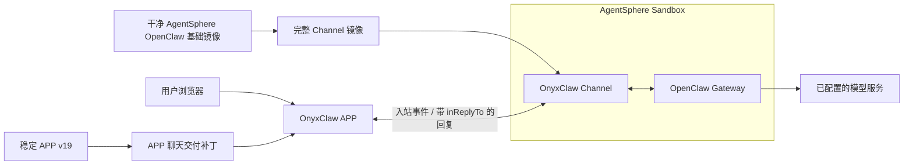

# OnyxClaw 当前架构

> 状态：**当前规范**。本文描述当前受支持的构建与运行时边界；实现行为有冲突时，以相关代码和回归测试为准。

OnyxClaw 的云端组合固定为：Huawei Cloud CCE 承载 APP，AgentSphere 提供运行
OpenClaw 与 OnyxClaw Channel 的 Sandbox。仓库只维护 APP 与 Channel 两类镜像的构建
输入和更新方案；实际部署操作由
[onyxclaw-one-click](https://github.com/KianaBin/onyxclaw-one-click) 维护。

可交互浏览的架构图见
[OnyxClaw 当前架构图](./assets/onyxclaw-current-architecture.html)。图的可维护源定义为
[`onyxclaw-current-architecture.architecture.json`](./assets/onyxclaw-current-architecture.architecture.json)。

## 组件与责任

| 组件 | 当前责任 | 不负责的内容 |
| --- | --- | --- |
| OnyxClaw APP | 接收浏览器请求、编排 Sandbox 生命周期、关联入站事件与回复 | 在浏览器中保存密钥或直接替换 Template |
| APP v19 | 可复建的稳定 APP 基线 | 作为聊天补丁的隐式可变来源 |
| APP 聊天交付补丁 | 在明确的 APP 基线上修复聊天关联与交付代码 | 覆盖或改写稳定 v19 |
| AgentSphere OpenClaw 基础镜像 | 提供 OpenClaw Gateway、envd、健康检查和默认运行目录 | 安装 OnyxClaw Channel |
| 完整 Channel 镜像 | 安装、启用并运行完整 OnyxClaw Channel 插件 | 只覆盖某一个插件修复文件 |
| OnyxClaw Channel | 将 APP 入站事件派发给 Gateway，并把回复作为关联的出站事件投递 | 以“下一条消息”推断回复归属 |
| OpenClaw Gateway | 处理 Channel 入站请求并调用已配置的模型服务 | 承担 CCE 或 Template 发布职责 |

## 聊天交付约束

- 每个 APP 入站事件都必须有稳定的回复关联键；出站回复通过 `inReplyTo` 指向其入站事件，不能采用 FIFO 或“下一条出站消息”推断。
- APP 与 Channel 是同一逻辑修复的两个发布单元。只更新其中一方会留下未修复的故障模式。
- Sandbox 恢复后的数据面准备与控制面恢复分开处理。APP 不能因数据面短暂未就绪而重复执行恢复或破坏已经恢复的 Sandbox。
- 运行时配置由 APP 为每个 Sandbox 生成；浏览器不得提交任意 API 地址、环境变量名、命令或密钥。

## 可观测性与数据边界

- 观测仅记录 APP 适配层实际发往 Sandbox Service 的调用状态、耗时和经脱敏的对象状态；不将 UI、Gateway、Channel 或模型推理耗时混入该指标。
- 观测数据不包含聊天正文、命令正文、文件内容、请求/响应正文、Header、token 或其他凭据。
- 内存中的观测记录是短期诊断信息，不是聊天历史或部署审计库。状态必须同时以文字和颜色表达，并遵守 `prefers-reduced-motion`。

## 构建和发布边界

- APP v19、APP 聊天补丁、干净 OpenClaw 基础镜像和完整 Channel 镜像的构建方式见
  [Huawei Cloud 镜像构建与更新方案](./huaweicloud-image-build-and-update.md)。
- Huawei AgentSphere 的非敏感配置样例和环境变量说明见
  [Provider 配置指南](./provider-config.md)。
- 候选镜像在开发机完成构建与容器内校验后，仍需发布负责人明确授权才可 push、更新 CCE 或替换 Template；这些实际操作由 one-click 仓库维护。

## 代码与测试依据

- APP 云端编排：[`packages/cloud-runtime/`](../packages/cloud-runtime/)
- Channel 入站与出站协议：[`packages/onyxclaw-channel/`](../packages/onyxclaw-channel/)
- 本地回归与验收编排：[`packages/test-orchestrator/`](../packages/test-orchestrator/)
